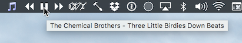
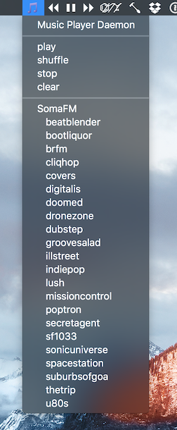
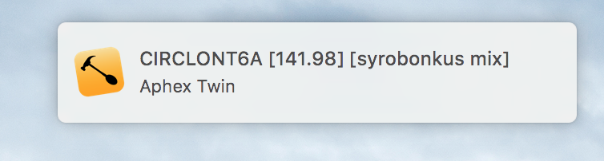

I recently discovered [mpd](http://www.musicpd.org) and found it to be a nice little program. There is a dearth of nice-looking OSX clients, though.

Using the `hs.socket` extension (not available quite yet), I've created a [Hammerspoon](http://hammerspoon.org) frontend that speaks the [mpd protocol](http://www.musicpd.org/doc/protocol/index.html). With what I have so far, it's already much faster and easier to use than iTunes. I'll post the code on the wiki once everything is finalized.

Using `hs.menubar`, I've created some menubar items to assist with controlling playback. Hovering over the play/pause icon shows the current track. Hovering over the next icon shows the next track, if not at the end of the playlist:  



The icons are defined with ASCIImage:
```lua
icon.next = [[ASCII:
..................
..1.......6.......
..................
..................
..................
..................
.......3.......8..
..................
..................
..................
..................
..2.......7.......
..................
]]
```

More options are in the 🎵 icon. Easy selection of internet radio stations, for one:  



Song changes are announced with `hs.notify`:  




Using `hs.chooser`'s `queryChangedCallback`, I send a search command to `mpd` and parse the results into a chooser list. Selecting an item adds it to the current playlist and immediately plays it.
Searching across the whole database (currently 540 artists, 524 albums, 6944 songs) is no problem at all:  

<p><video width="640" height="480" autoplay loop muted>
<source src="media/search.mp4" type="video/mp4">
</video></p>

I have another `hs.chooser` that pulls album names. Selecting one enqueues the whole album onto the current playlist:  

<p><video width="640" height="480" autoplay loop muted>
<source src="media/album.mp4" type="video/mp4">
</video></p>
