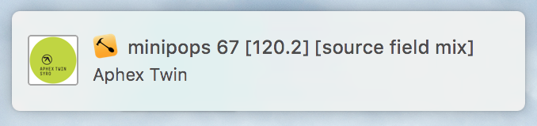

I recently discovered [mpd](http://www.musicpd.org) and found it to be a nice little program. There is a dearth of nice-looking OSX clients, though (besides terminal clients).

Using the [`hs.socket`](https://github.com/Hammerspoon/hammerspoon/pull/791) extension (not available quite yet in upstream), I've created a [Hammerspoon](http://hammerspoon.org) frontend that speaks the [mpd protocol](http://www.musicpd.org/doc/protocol/index.html). With what I have so far, it's already much faster and easier to use than iTunes. I'll link the code on the [Hammerspoon wiki](https://github.com/Hammerspoon/hammerspoon/wiki/Sample-Configurations) once everything is finalized.

Using [`hs.menubar`](http://www.hammerspoon.org/docs/hs.menubar.html), I've created a series of menubar items to assist with controlling playback. Hovering over the play/pause icon shows the current track. Hovering over the next icon shows the next track in the playlist:  

  


The icons are defined with [ASCIImage](https://github.com/cparnot/ASCIImage) which work seamlessly [anywhere](http://www.hammerspoon.org/docs/hs.image.html#imageFromASCII) in Hammerspoon:  

```lua
icon.next = [[ASCII:  
..................  
..1.......6.......  
..................  
..................  
..................  
..................  
.......3.......8..  
..................  
..................  
..................  
..................  
..2.......7.......  
..................  
]]
```

More options are in the 🎵 icon (just `hs.menubar:setTitle("🎵")`). Easy selection of internet radio stations, for one:  


Song changes are announced with [`hs.notify`](http://www.hammerspoon.org/docs/hs.notify.html):  




Using [`hs.chooser:queryChangedCallback`](http://www.hammerspoon.org/docs/hs.chooser.html#queryChangedCallback), I send a search command to mpd and parse the results into a chooser list. Selecting an item adds it to the current playlist and immediately plays it.
Searching across the whole database (currently about 7000 songs, still in the process of migrating a bunch of music using [beets](http://beets.io)) is no problem at all:  

<p><video width="640" height="480" autoplay loop muted>
<source src="media/search.mp4" type="video/mp4">
</video></p>

I have another `hs.chooser` that pulls album names. Selecting one enqueues the whole album onto the current playlist:  

<p><video width="640" height="480" autoplay loop muted>
<source src="media/album.mp4" type="video/mp4">
</video></p>

Now with album art! Added a function to `hs.image` that extracts album art using `AVFoundation`'s `AVAsset` class:  


